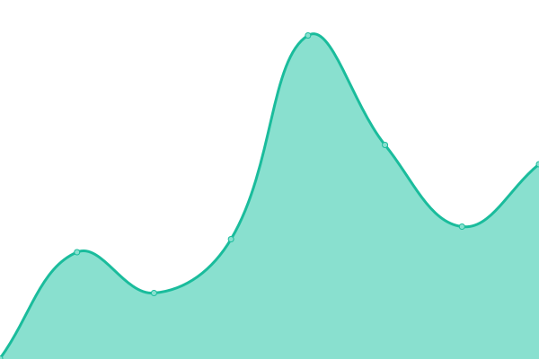
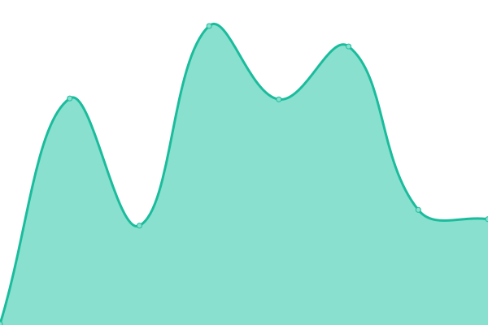

# [📈 Live Status](https://status.joinyearone.io): <!--live status--> **🟩 All systems operational**

This repository contains the open-source uptime monitor and status page for [YearOne](https://status.joinyearone.io), powered by [Upptime](https://github.com/upptime/upptime).

With [Upptime](https://upptime.js.org), you can get your own unlimited and free uptime monitor and status page, powered entirely by a GitHub repository. We use [Issues](https://github.com/joinyearone/upptime/issues) as incident reports, [Actions](https://github.com/joinyearone/upptime/actions) as uptime monitors, and [Pages](https://status.joinyearone.io) for the status page.

<!--start: status pages-->
<!-- This summary is generated by Upptime (https://github.com/upptime/upptime) -->
<!-- Do not edit this manually, your changes will be overwritten -->
<!-- prettier-ignore -->
| URL | Status | History | Response Time | Uptime |
| --- | ------ | ------- | ------------- | ------ |
|  [YearOne App Website](https://app.joinyearone.io) | 🟩 Up | [year-one-app-website.yml](https://github.com/joinyearone/upptime/commits/HEAD/history/year-one-app-website.yml) | 

 357ms
     
 | 

<a href="https://status.joinyearone.io/history/year-one-app-website">100.00%</a>
    

|  [YearOne Marketing Website](https://joinyearone.io) | 🟩 Up | [year-one-marketing-website.yml](https://github.com/joinyearone/upptime/commits/HEAD/history/year-one-marketing-website.yml) | 

 506ms
     
 | 

<a href="https://status.joinyearone.io/history/year-one-marketing-website">100.00%</a>
    

|  [Flow Customer API](https://flow.pluralsight.com/v3/customer/core/docs/) | 🟩 Up | [flow-customer-api.yml](https://github.com/joinyearone/upptime/commits/HEAD/history/flow-customer-api.yml) | 

 285ms
     
 | 

<a href="https://status.joinyearone.io/history/flow-customer-api">100.00%</a>
    

|  [Flow Collaboration API](https://flow-api.pluralsight.com/collaboration/docs) | 🟩 Up | [flow-collaboration-api.yml](https://github.com/joinyearone/upptime/commits/HEAD/history/flow-collaboration-api.yml) | 

 445ms
     
 | 

<a href="https://status.joinyearone.io/history/flow-collaboration-api">100.00%</a>
    

<!--end: status pages-->

[**Visit our status website →**](https://status.joinyearone.io)

## 📄 License

- Powered by: [Upptime](https://github.com/upptime/upptime)
- Code: [MIT](./LICENSE) © [YearOne](https://status.joinyearone.io)
- Data in the `./history` directory: [Open Database License](https://opendatacommons.org/licenses/odbl/1-0/)
